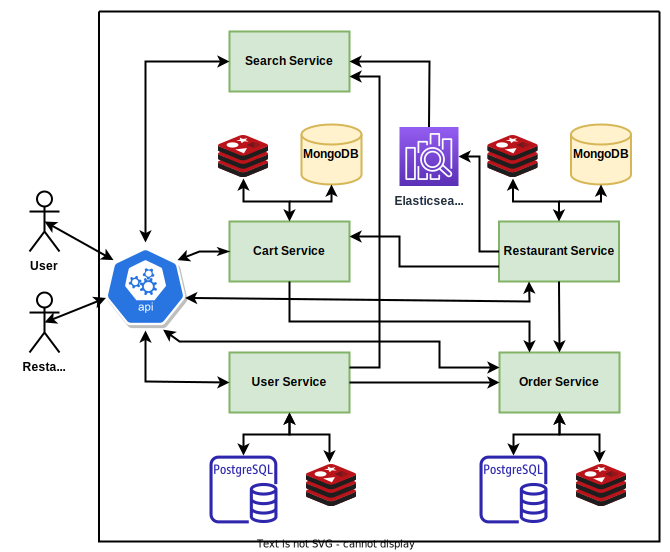

# EatNow

Demo backend for a food ordering app.

---

&nbsp;&nbsp;&nbsp;&nbsp;&nbsp;&nbsp;&nbsp;&nbsp;&nbsp;&nbsp;&nbsp;&nbsp;&nbsp;&nbsp;&nbsp;&nbsp;&nbsp;&nbsp;&nbsp;&nbsp;&nbsp;&nbsp;&nbsp;&nbsp;&nbsp;&nbsp;&nbsp;&nbsp;&nbsp;&nbsp;&nbsp;&nbsp;&nbsp;&nbsp;&nbsp;&nbsp;&nbsp;&nbsp;&nbsp;&nbsp;&nbsp;&nbsp;&nbsp;&nbsp;&nbsp;&nbsp;&nbsp;&nbsp;&nbsp;&nbsp;&nbsp;&nbsp;&nbsp;&nbsp;

---

## Features:

- Restaurant and menu management.
- Full-text and nearby search.
- User account management.
- Shopping cart.
- Order management.
- JWT based API authorization.
- Swagger API documentation across all microservices.

## Contents
1. [Architecure](#architecture)
2. [Running the app](#running)
    - [Docker Compose](#docker)
    - [Kubernetes](#kubernetes)
3. [Using the app with Swagger](#swagger)
4. [Usage instructions](#usage)

## Architecture <a name="architecture"></a>


## Running the app <a name="running"></a>
Run the app with ```Docker Compose``` or in a local ```Minikube Kubernetes``` cluster. Both methods require installation of [Docker Desktop](https://www.docker.com/products/docker-desktop/). Linux users should also complete these [post installation steps](https://docs.docker.com/engine/install/linux-postinstall/#manage-docker-as-a-non-root-user).

### Method 1: Docker Compose (simple) <a name="docker"></a>

1) Ensure port 80 is free.

2) Clone this repository and cd into it.
```
git clone https://github.com/ebinphilip/eatnow && cd eatnow
```
3) Start the app with Docker Compose. This step will take 10-15 mins in the initial run, but should take less than a minute in subsequent runs.
```
docker compose up
``` 
4) If some of the services fail to load in the initial run, then do Ctrl+C and repeat step 3. After all the services have started, the app can be found at:
    - API url: http://localhost
    - Swagger UI: http://localhost/swagger-ui/index.html or http://localhost:8087//swagger-ui/index.html

### Method 2: Minikube Kubernetes cluster (tedious) <a name="kubernetes"></a>

1) Install [minikube](https://minikube.sigs.k8s.io/docs/start/) & [kubectl](https://kubernetes.io/docs/tasks/tools/).
2) Configure minikube vm to use 6GB RAM. Providing less than 4GB can cause some of the services to go into a crash loop.
```
minikube config set memory 6144
```
3) Start minikube, increase max virtual memory, enable ingress and store minikube ip into a config map.
```
minikube start
```
```
minikube ssh 'sudo -s sysctl -w vm.max_map_count=262144'
```
```
minikube addons enable ingress
```
```
kubectl create configmap eatnow-api-host --from-literal=API_HOST=$(minikube ip) --dry-run=client -o yaml | kubectl apply -f -
```
4) Clone this repository and cd into it.
```
git clone https://github.com/ebinphilip/eatnow && cd eatnow
```
5) Mount the init-db folder from the project directory into the minikube vm. Do this in a separate shell. Leave it running.
```
minikube mount ./init-db:/init-db
```
6) Start all services.
```
kubectl apply -f kubernetes/
```
7) Wait for Step 6 to complete. Use the minikube dashboard for monitoring the services. Wait until all deployments become stable. That should take 10 mins.
```
minikube dashboard
```
8) Get the ip of the cluster. This will be the API url.
```
minikube ip
```
9) After all the services have started, the app can found at:

    - API url: http://\<minikube-ip>
    - Swagger UI: http://\<minikube-ip>/swagger-ui/index.html or http://\<minikube-ip>:32000/swagger-ui/index.html

## Using the app with Swagger <a name="swagger"></a>
The swagger UI, in addition to providing API documentation, also happens to be the easiest way to use this app. API definitions across different microservices can be selected from the definition drop-down on the top right.


The following error indicates that the service in question, is not ready yet. The solution is to wait and retry. If that doesn't help, restart the service.


## Usage instructions <a name="usage"></a>

This section describes the expected workflow when using the EatNow app, through the provided APIs.
### 1) User account : User APIs
1) Create a user account, with a unique user-id.
2) Login with this user-id to get a user token.
3) Create an address for the user, using the token. Keep the address coordinates within the town of [Kottayam](https://goo.gl/maps/418YqgD2kbRjadEMA). All the restaurant data populated in the DB is from Kottayam. Right clicking on any location in google maps gives you the coordinates of that point.
4) The address index returned in the previous step along with user-id, is used to uniquely identify a user address.

### 2) Search for restaurants/items : Search APIs
1) Search for restaurants or menu items by name.
2) All searches take into account the location of the user. In addition to latitude/longitude pairs, the address-index from the previous stage can also be used to provide location details.
4) Search results for restaurants contain a restaurant ID. Search results for items, contain both a restaurant ID and an item index. These will be used in subsequent stages.

### 3) View Restaurants/Menus : Restaurant APIs
1) Restaurants and menus can be fetched using correspoding restaurant IDs.
2) The menu contains an index for each item. The combination of restaurant ID and item-index is used to uniquely identify an item.

### 4) Shopping cart: Cart APIs
1) Add items to cart using restaurant ID and item index.
2) Updating cart items and their quantities is possible.

### 5) Placing orders: Order APIs (User)
1) Use the order-request-from-cart API to generate an order request JSON from the shopping cart.
2) Post the order request created in the previous step to create an order. The response body will contain a unique order ID.
3) Use the order ID to perform payment. This is just a dummy step, no payment details or actual payment is required.

### 6) Restaurant management: Restaurant APIs
1) Login with a restaurant ID to get the token for that restaurant.
2) This token can be used to update restaurant and menu details, in addition to order management.


### 7) Order management: Order APIs (Restaurant)
1) Use the restaurant token from the previous stage to view and manage orders.
2) After payment is complete, the status of an order is set to NEW. This order should then be ACCEPTED by the restaurant and finally marked COMPLETED.
3) An order with NEW/ACCEPTED status can be cancelled by the restaurant.


