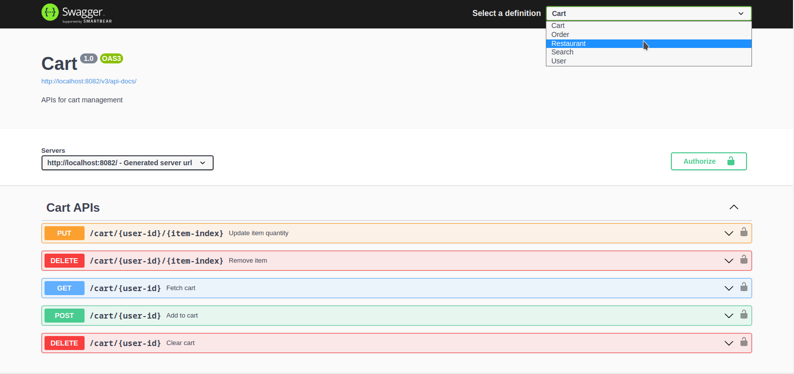
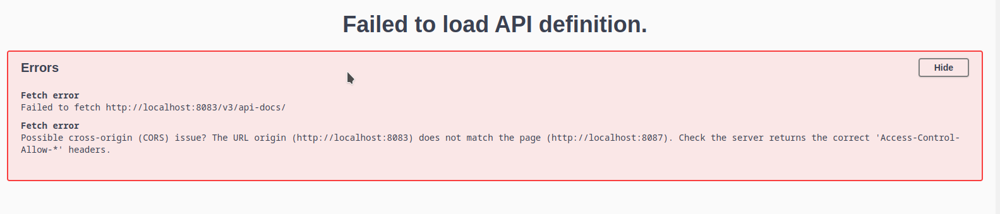

# EatNow

Demo backend for a food ordering app.

## Features:

- Restaurant and menu management.
- User account management.
- Plain text and nearby searching.
- Shopping cart.
- Order management.
- JWT based API authorization.
- Swagger API documentation across all microservices.

## Running the app:
This app can be run with ```Docker Compose``` or in a local ```Minikube Kubernetes``` cluster. Both methods require installation of Docker Desktop. Linux users should also complete these post installation steps.

### Method 1: Docker Compose (simple)

0) Ensure port 80 is freee

1) Clone this repository and and navigate to the project directory from terminal.
```
git clone https://github.com/ebinphilip/eatnow
cd eatnow
```
2) Start the app with Docker Compose. This step will take 10-15 mins in the initial run, but should take less than a minute in subsequent runs.
```
docker compose up
``` 
3) All the services should up and running. If not, do Ctrl+C and then repeat step 2.
    - API Url: http://localhost:80
    - Swagger UI: http://localhost/swagger-ui/index.html or http://localhost:8087//swagger-ui/index.html

### Method 2: Minikube Kubernetes cluster (tedious)

1) Install minikube.
2) Configure the minikube vm to use 6GB RAM. Less than 4GB can cause ElasticSearch to fail.
```
minikube config set memory 6144
```
3) Start minikube, increase max virtual memory, enable ingress and store minikube ip into a config map.
```
minikube start
minikube ssh 'sudo -s sysctl -w vm.max_map_count=262144'
minikube addons enable ingress

kubectl create configmap eatnow-api-host --from-literal=API_HOST=$(minikube ip) --dry-run=client -o yaml | kubectl apply -f -
```
4) Clone this repository and and navigate to the project directory from terminal.
```
git clone https://github.com/ebinphilip/eatnow
cd eatnow
```
5) Mount the init-db folder into the minikube vm. Open another terminal in the same directory and this should not be closed while the app is running.
```
minikube mount ./init-db:/init-db
```
6) Start the microservices.
```
kubectl apply -f kubernetes/
```
7) Wait for Step 6 to complete. The progress can be monitored from the minikube dashboard. Wait until all deployments are running successfully. That should be around 10 mins.
```
minikube dashboard
```
8) Get the minikube ip.
```
minikube ip
```
9) When the app is running, it can found at:

    - API Url: http://\<minikube-ip>
    - Swagger UI: http://\<minikube-ip>/swagger-ui/index.html or http://\<minikube-ip>:32000/swagger-ui/index.html

## Using the APIs with Swagger
The swagger UI, in addition to API documentation, also provides the easiest way to use these APIs. APIs from different microservices can be selected from the definition drop-down on the top right.



If any API definition page throws an error, wait a bit longer for that service to finish loading or try restarting.



## Usage workflow

This section describes the expected workflow while using the EatNow APIs.
### 1) User workflow : USER APIs
1) Create a user account, with a unique user-id
2) Login with user-id and retrieve the user token. This token will be reqired in all further stages.
3) Use the user token to create a user address. Keep the address coordinates in and around the town of [Kottayam](https://goo.gl/maps/418YqgD2kbRjadEMA), since all the restaurant data used in this app is from this town.
4) The address index returned here will be required for searching as well as placing orders.

### 2) Search for restaurants/items : Search APIs
1) Search for restaurants or menu items by name.
2) All searches also takes into account the location of the user.
3) Different sets of APIs allow this location to passed as latitude/longitude pairs or the address-index of the previously created user address.
4) Search results for restaurants contain the restaurant ID. In the case of items, both restaurant ID and item index are provided. This will be used in upcoming stages.

### 3) View Restaurants/Menus : Restaurant APIs
1)  Fetch details of restaurants and menus by restaurant IDs, returned by the search APIs in the previous stage.
2) The menu provides an index to each item. This item index is used for adding to cart and placing orders.

### 4) Shopping cart: Cart APIs
1) Add an item to cart by restaurant ID and item index in the menu.
2) Modification of cart items and their quantities is possible.

### 5) Placing orders: Order APIs (User)
1) Use the order-request-from-cart API to create an order request body from the shopping cart.
2) Post the request body created in the previous stage to create an order. The response body will contain a unque order ID.
3) Use this order ID to make payment.


### 6) Restaurant management: Restaurant APIs
1) Login with a restaurant ID to get the token for that restaurant.
2) This token can be used to update restaurant and menu details, in addition to order management.


### 7) Order management: Order APIs (Restaurant)
1) Use the restaurant token from the previous stage to manage orders.
2) After payment is done by the user, an order is marked with NEW status. This must then be marked ACCEPTED by the restaurant and finally marked COMPLETED.
3) An order with NEW/ACCEPTED status can be cancelled by the restaurant.


